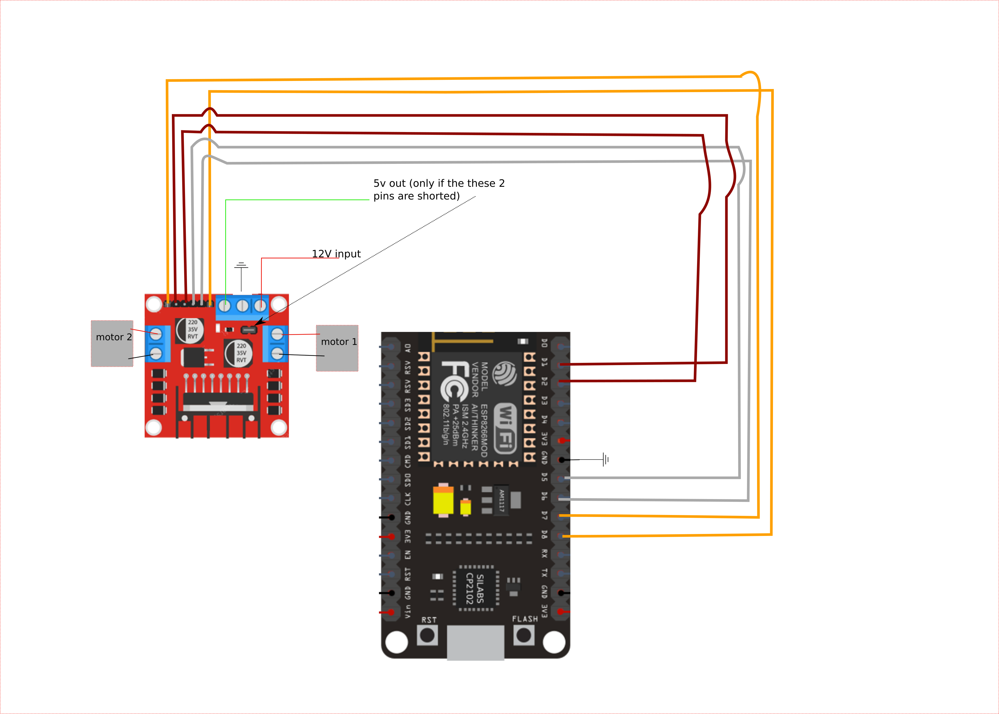

# Capstone project healthbot

The Ros and gazebo files are in the src dir, the coppeliaSim files in the coppeliaSim dir

## Navigation
Basic object detection is made with ultrasonic
OpenVslam is used for one camera navigation
RTAB-Map is used for stereo camear and lidar http://wiki.ros.org/rtabmap_ros
useful stereo package http://wiki.ros.org/stereo_image_proc/Tutorials/ChoosingGoodStereoParameters
other useful resources
https://automaticaddison.com/working-with-ros-and-opencv-in-ros-noetic/
https://docs.opencv.org/master/dd/d53/tutorial_py_depthmap.html

## To start the ROS project

1. at the root of the workspace do `catkin_make && source devel/setup.sh`
2. Do `roslaunch pkg launchfile` u can choose from the ones below
   
   
launch rviz
`roslaunch healthbot rviz.launch`

launch gazebo using an urdf model
`roslaunch healthbot urdf_world.launch`

launch gazebo with the sdf model
` roslaunch healthbot sdf_world.launch`

Joint_state_publisher allows you to control the joint values, u can check it out in Rviz

## About the model
At the time of making this robot Rviz has problems with Gazebo's files, .sdf, so one has to convert to urdf files first.
The robot model was constructed in the gazebo gui, so the output is an sdf file, we need to convert that to urdf file to use in ros
use the command to convert, this is already done but if you want to make edits dont edit urdf directly unless u know what u r doing
`rosrun pysdf sdf2urdf.py src/healthbot/sdf/healthbot/model.sdf src/healthbot/urdf/healthbot.xacro`

_Note_ You will NOT be able to convert unless the gazebo sdf verison is 1.6 or below so go to the sdf file and edit it to 1.6 in the sdf verison tag

To check if your urdf is correct use this command
`check_urdf healthbot.xacro`

There are many 'partial' models, both in the sdf and the urdf dirs, but the main robot model is the 'healthbot' model, everything else is just kept there for reference

# I switched to orbslam
openvslam got shutdown so I had to switch to orbslam here are the instructions on how to run it below

follow this but u can run the built in r200 mono launch file
 https://medium.com/@mhamdaan/implementing-orb-slam-on-ubuntu-18-04-ros-melodic-606e668deffa
camera calibration 
`rosrun camera_calibration cameracalibrator.py --size 8x6 --square 0.26 image:=/usb_cam/image_raw camera:=/usb_cam --no-service-check`
- if u wanna test your own camera make sure to calibrate it and put the camera.yaml file to the parameter server ( u can use the medium tutorial above, it has a section on how to do it)
- run rviz with the config file in the orbslam2 and you will see params that you can edit
- my launch file has a bunch of remaps this is cuz my camera publishes to topic /usb_cam, while the code listens to topic /camera

## how to run
1. open the usb camera using `roslaunch usb_cam my_usb_cam_test.launch`
2. open orbslam2 docker (the ros fork, not the main repo) and launch the r200 mono launch file (or whatever launch file u made) 
	2-1. `docker run -it --name orbslam --net=host bd0dd564b380` or if u already have the stopped container then just do `docker start -i the-container-id`
	2-2.`roslaunch orb_slam2_ros myLaunch.launch`
3. open rviz with the mono config that I made, it is in the config dir
`rviz -d ./rviz_config_mono.rviz`

# Run SLAM with coppelliaSIM simlation instead of real robot
it is the same as how to run steps from above, only that we are doing it with coppeliasim instead of
real camera
1. run the copelliaSim folder that has slam in its name
2. run the orb slam launch file roslaunch src/orb_slam_2_ros/ros/launch/mySimulationLaunch.launch 
3. run rviz just like from above

## Motor Control
*motor control connections, without sensors*
## Misc
This is not important, but if u have troubles with gazebo make sure `GAZEBO_RESOURCE_PATH` has the path to the sdf file if you will load from sdf.
