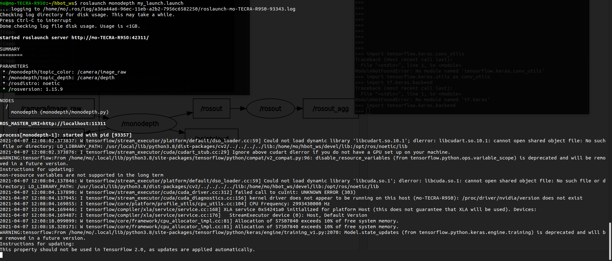
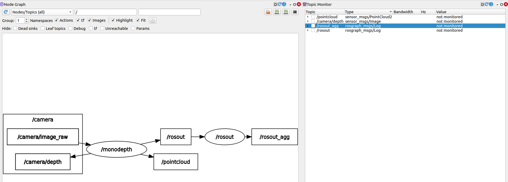
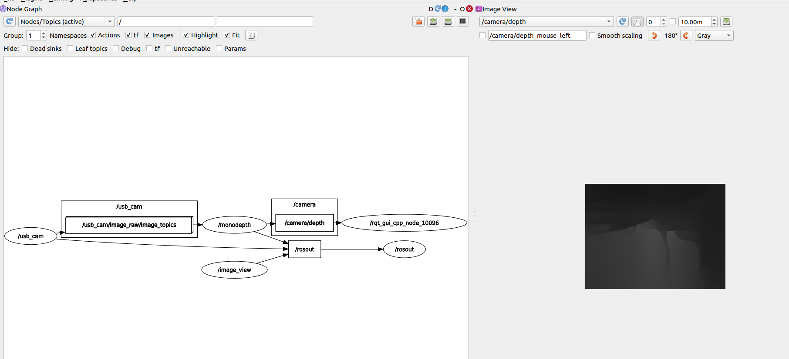
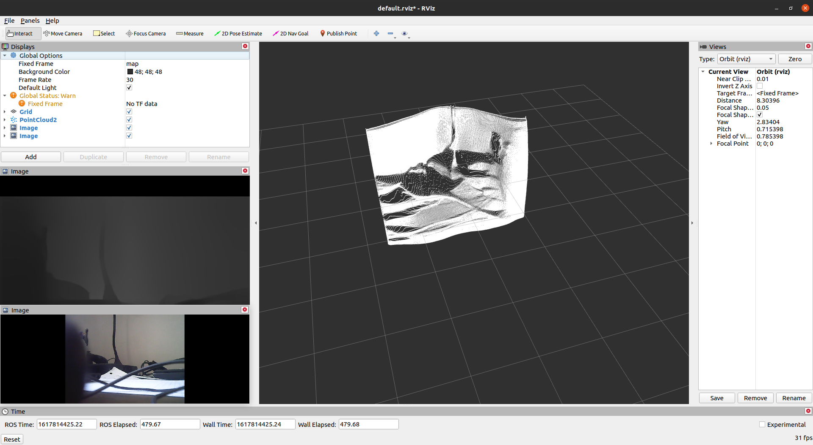
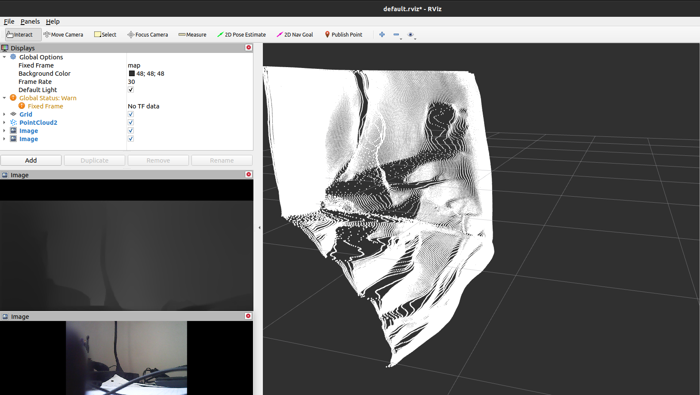

# Python3 adaption
This updates the original repo and makes it work with Python3, it fixes the tensorflow and keras imports to make them py3 compatible at the time of making this repo, there are warning in the run terminal that says that somethings will be not supported in the future so depending on when you use this repo you might need to update some imports, this worked at the time of writing this at April 7th 2021 with results screenshots posted below.

1. install Requirements
`pip3 install numpy tensorflow opencv-python rospkg`
2. `catkin_make`
3. `roslaunch monodepth my_launch.launch` 
 *example of it running without any input topics*


You can ignore the 'cu' errors as we don't have cuda gpus in my test machine, but we see that it is working without errors.

*example of it working with webcam feed*
I have added a remap in the launch file to map my usb camera to the monodepth node, you can edit that remap depending on your camera topic

This pic is taken from rviz, it shows pointcloud2 data.
Another angle

Note, the performance was very slow, it would take more than 10 seconds to compute 1 depth image. Maybe this is because my computer doesn't have a graphics card and is running on the cpu only.

---

# Original repo Readme 
## Mono Depth ROS
 - ROS node used to estimated depth from monocular RGB data.
 - Should be used with Python 2.X and ROS
 - The original code is at the repository [Dense Depth Original Code](https://github.com/ialhashim/DenseDepth)
 - [High Quality Monocular Depth Estimation via Transfer Learning](https://arxiv.org/abs/1812.11941) by Ibraheem Alhashim and Peter Wonka


### Configuration

- Topics subscribed by the ROS node
  - /image/camera_raw - Input image from camera (can be changed on the parameter topic_color)
- Topics published by the ROS node, containing depth and point cloud data generated.
  - /image/depth - Image message containing the depth image estimated (can be changed on the parameter topic_depth).
  - /pointcloud - Pointcloud2 message containing a estimated point cloud (can be changed on the parameter topic_pointcloud).
- Parameters that can be configuration
  - frame_id - TF Frame id to be published in the output messages.
  - debug - If set true a window with the output result if displayed.
  - min_depth, max_depth - Min and max depth values considered for scaling.
  - batch_size - Batch size used when predicting the depth image using the model provided.
  - model_file - Keras model file used, relative to the monodepth package.


### Setup

- Install Python 2 and ROS dependencies

```bash
apt-get install python python-pip curl
pip install rosdep rospkg rosinstall_generator rosinstall wstool vcstools catkin_tools catkin_pkg
```

- Install project dependencies

```bash
pip install tensorflow keras pillow matplotlib scikit-learn scikit-image opencv-python pydot GraphViz tk
```

- Clone the project into your ROS workspace and download pretrained models

```bash
git clone https://github.com/tentone/monodepth.git
cd monodepth/models
curl –o nyu.h5 https://s3-eu-west-1.amazonaws.com/densedepth/nyu.h5
```


### Launch

- Example ROS launch entry provided bellow, for easier integration into your already existing ROS launch pipeline.

```xml
<node pkg="monodepth" type="monodepth.py" name="monodepth" output="screen" respawn="true">
    <param name="topic_color" value="/camera/image_raw"/>
    <param name="topic_depth" value="/camera/depth"/>
</node>
```


### Pretrained models

 - Pre-trained keras models can be downloaded and placed in the /models folder from the following links:
    - [NYU Depth V2 (165MB)](https://s3-eu-west-1.amazonaws.com/densedepth/nyu.h5) 
    - [KITTI (165MB)](https://s3-eu-west-1.amazonaws.com/densedepth/kitti.h5)


### Datasets for training
 - [NYU Depth V2 (50K)](https://cs.nyu.edu/~silberman/datasets/nyu_depth_v2.html) 
    - The NYU-Depth V2 data set is comprised of video sequences from a variety of indoor scenes as recorded by both the RGB and Depth cameras from the Microsoft Kinect.
    - [Download dataset](https://s3-eu-west-1.amazonaws.com/densedepth/nyu_data.zip) (4.1 GB)
 - [KITTI Dataset (80K)](http://www.cvlibs.net/datasets/kitti/) 
    - Datasets captured by driving around the mid-size city of [Karlsruhe](http://maps.google.com/?ie=UTF8&z=15&ll=49.010627,8.405871&spn=0.018381,0.029826&t=k&om=1), in rural areas and on highways. Up to 15 cars and 30 pedestrians are visible per image.


